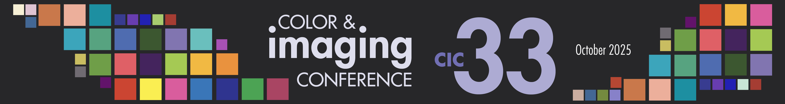
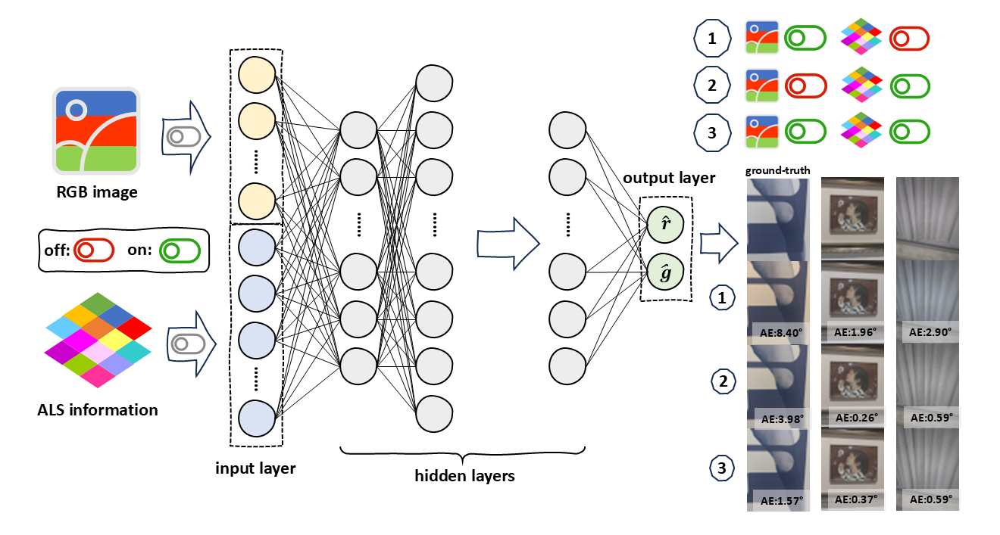

<p align="center">
    <h1 align="center">
    Demo code: Integration of RGB Image and ALS for Color Constancy
    </h1>
</p>

***Ruikai He***, ***Minchen Wei***

> *ALS information*: low-resolution multispectral data of scene illuminant



## Quickstart

### Linear Transformation for Illuminant Estimation

1. `./LinearTransformation/mainFunc_Demo.ipynb` shows the framework of illuminant estimation by Linear Transformation including data split and $M$ matrix solution
2. `./necessarityFunc.py` includes two core functions including **Gap-Statstic** for hyperparameter `n_cluster` and choose training data by `K-Means`.
3. The demo dataset is Normal Dataset: `data_ALSs_NormalDataset.npy` and `data_WPs_NormalDataset.npy` stores ALS information and RGB illuminant color of corresponding scene. 

### fine-tuned C5 with different input choices

1. tested on Linux and `pytorch==2.4.1`
2. model training follows the code cell:
   
   ```
   cd ./C5_13Spectral
   python train.py --use-spectral 1 --learn-G True --training-dir-in ./dataset/Dataset_Normal
   ```
3. test the trained model follows the code cell:
   
   ```
   cd ./C5_13Spectral
   python test.py --use-spectral 1 --use-spectral-input 0 --testing-dir-in ./dataset/Dataset_Normal --g-multiplier True
   ```
4. `--use-spectral` controls input choices
   1. `--use-spectral 1` means using both ALS information and RGB images (DUAL input chocies)
   2. `--use-spectral 0` means using only RGB images (ORGB input chocies)
5. `--use-spectral-input` controls input choices, only valid for model testing
   1. `--use-spectral-input 0` follows the configuration of `--use-spectral`
   2. `--use-spectral-input 1` means test using only ALS information (OALS input choices)
   3. `--use-spectral-input 2` means test using only RGB images (ORGB)
6. the demo dataset is `Normal Dataset`: `./dataset/Dataset_Normal/numpy_data/*.npz` saves the RAW-RGB image and corresponding ALS information, and `./dataset/Dataset_Normal/numpy_labels/*.npy` saves the RGB illuminant color of scene. 
7. acknowledge [the public availibility of the initial C5 model](https://github.com/mahmoudnafifi/C5), the project `C5_13Spectral` is built upon the initial C5 model.

### fine-tuned PCC with different input choice

1. the configuration and platform are the same as the point #1 in **fine-tuned C5 with different input choices**
2. model training follows the code cell:
   
   ```
   cd ./PCC_13Spectral
   python script_train.py
   ```
3. following the previous point (#2), `-mode` controls training input choices
   1. `-mode semantic_spectral` means input choice DUAL / using both ALS information and RGB images
   2. `-mode spectral` means input choice OALS / using only ALS information
   3. `-mode semantic` means input choice ORGB / using only RGB images
4. Before test your model, please make you can rename the model folder, `fold_0`, `fold_1`, and `fold_2`
5. model testing follows the next code cell example:
   
   ```
   cd ./PCC_13Spectral
   python test.py -input_mode 0 -data_path ./dataset/Dataset_Normal -mode spectral
   ```
6. follwing the previous point (#5), `-input_mode` exclusive to testing model, control testing input choices
   1. `-input_mode 0` means the same as `-mode` input choice
   2. `-input_mode 1` means input choice OALS / using only ALS information
   3. `-input_mode 2` means input choice ORGB / using only RGB images
7. the demo dataset is the same as that in **fine-tuned C5 with different input choices**, check the details in Point #6 in the corresponding section.
8. acknowledge [the public availability of the initial PCC model](https://github.com/shuwei666/Color-Constancy-PCC). This part is built upon the initial PCC model.

### fin-tuned ucc with different input choice

1. the configuration and platform are the same as the point #1 in **fine-tuned C5 with different input choices** and **fine-tuned PCC with different input choice**
2. the demo dataset is the same as that in **fine-tuned C5 with different input choices**, check the details in Point #6 in the corresponding section.
3. model training follows the code cell:
   
   ```
   cd ./ucc_13Spectral
   python script_train.py
   ```
4. following the previous point (#3), `--use_spec` controls the input choices during model training
   1. `--use_spec 1` means input choice DUAL / using both ALS information and RGB images
   2. `--use_spec 0` means input choice ORGB / using only RGB images
5. model testing following the code cell:
   
   ```
   cd ./ucc_13Spectral
   python test.py --use_spec 1 --input_mode 0 --data_dir ./dataset/Dataset_Normal
   ```
6. following the previous point (#5), `--input_mode` controls the input choices during model testing
   1. `--input_mode 0` means follows the input choice during model training
   2. `--input_mode 1` means input choice OALS / tested using only ALS information
   3. `--input_mode 2` means input choice ORGB / tested using only RGB images
